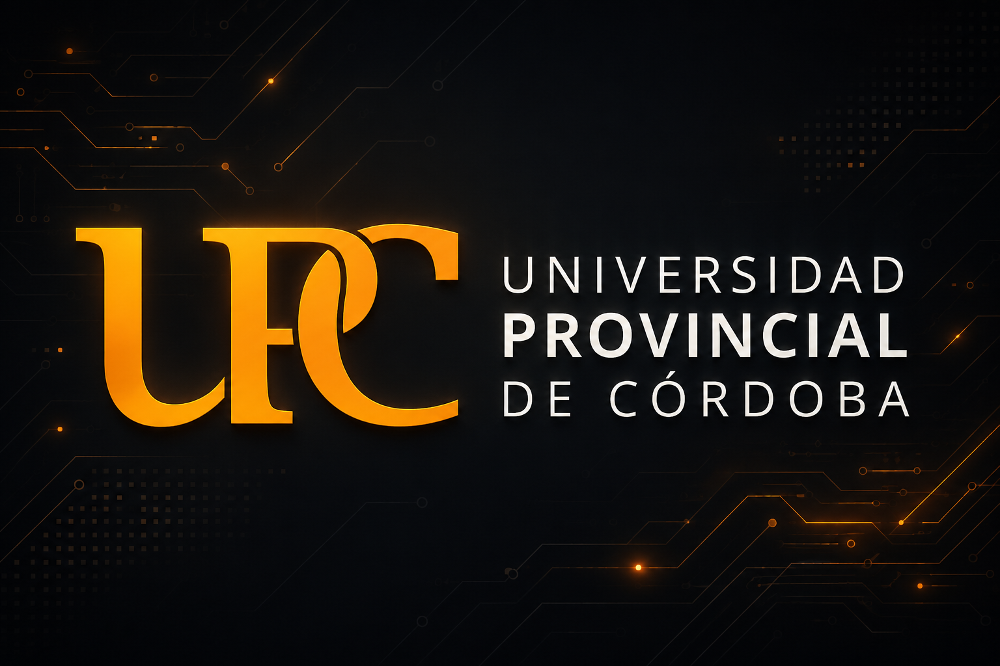

# 🚀 NovaSub

<p align="center">
  
</p>

<p align="center">
  <strong>Sistema de Gestión de Suscripciones y Facturación Premium</strong>
</p>

<p align="center">
  Proyecto académico desarrollado en TypeScript aplicando Programación Orientada a Objetos, principios SOLID y patrones de diseño.
</p>

---

## 🌐 Demo Online

🔗 https://suscripciones-premium-poo.vercel.app/

---

## 🏛️ Contexto Académico

<p align="center">
  
</p>

**Universidad Provincial de Córdoba (UPC)**

**Carrera:** Tecnicatura Universitaria en Programación Full Stack

**Materia:** Programación Orientada a Objetos

**Profesor:** Narciso Perez

**Autor:** Federico Montoro

**Año:** 2026

---

## 🎯 Objetivo

NovaSub es una prueba de concepto que simula un sistema de gestión de suscripciones premium y facturación automática.

El proyecto fue diseñado para demostrar la aplicación práctica de:

* Programación Orientada a Objetos
* Principios SOLID
* Patrones de Diseño
* Arquitectura MVC
* Arquitecturas desacopladas y escalables

---

## 🧠 Patrones Implementados

### 🔹 Singleton

`DatabaseConnection`

Mantiene una única instancia de la base de datos en memoria.

### 🔹 Factory Method

* PlanFactory
* NotificationFactory

Permiten crear objetos sin acoplar la lógica de creación al cliente.

### 🔹 Repository Pattern

* IUserRepository
* ISubscriptionRepository
* IInvoiceRepository

Separan la persistencia de la lógica de negocio.

### 🔹 Observer

PaymentService notifica automáticamente:

* NotificationObserver
* MetricsServiceObserver
* AccessControlObserver

tras cada pago exitoso.

### 🔹 MVC

* Models
* Views
* Controllers

Separación clara de responsabilidades.

---

## ⚖️ Principios SOLID

| Principio | Aplicación                                                    |
| --------- | ------------------------------------------------------------- |
| SRP       | Cada clase tiene una única responsabilidad                    |
| OCP       | Nuevos planes y notificaciones sin modificar código existente |
| LSP       | Los planes son intercambiables mediante la abstracción Plan   |
| ISP       | Interfaces pequeñas y específicas                             |
| DIP       | Dependencias inyectadas mediante abstracciones                |

---

## 🔄 Flujo del Sistema

Usuario

⬇

Registro

⬇

Selección de Plan

⬇

Suscripción

⬇

Pago

⬇

Factura

⬇

Observers

⬇

Acceso Premium

---

## 🛠️ Tecnologías

* TypeScript
* Node.js
* GitHub
* GitHub Projects
* Docker
* Vercel
* Mermaid UML

---

## 📂 Estructura

```txt
src/
├── Models/
├── Views/
├── Controllers/
├── Services/
├── Repositories/
├── Factories/
├── Observers/
└── Config/
```

## ✅ Resultados

* ✔ Singleton implementado
* ✔ Factory Method implementado
* ✔ Repository Pattern implementado
* ✔ Observer implementado
* ✔ MVC implementado
* ✔ Principios SOLID aplicados
* ✔ TypeScript estricto
* ✔ Pruebas automatizadas exitosas

---

## 🔗 Enlaces

🌐 Demo:

https://suscripciones-premium-poo.vercel.app/

📦 Repositorio:

https://github.com/Frederick1824/suscripciones-premium-poo

---

<p align="center">
  Desarrollado por <strong>FreToKa</strong>
</p>

<p align="center">
  TypeScript · SOLID · Design Patterns · 2026
</p>
