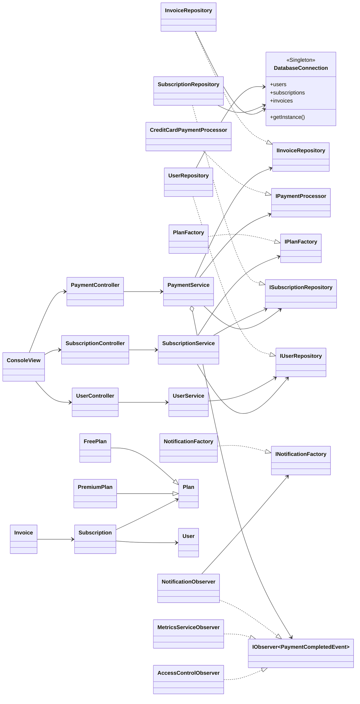

# Diagrama de clases

```mermaid
classDiagram
direction LR

class DatabaseConnection {
  <<Singleton>>
  +users
  +subscriptions
  +invoices
  +getInstance()
}

class IUserRepository
class ISubscriptionRepository
class IInvoiceRepository
class IPlanFactory
class INotificationFactory
class IPaymentProcessor
class IObserver~PaymentCompletedEvent~

UserRepository ..|> IUserRepository
SubscriptionRepository ..|> ISubscriptionRepository
InvoiceRepository ..|> IInvoiceRepository
PlanFactory ..|> IPlanFactory
NotificationFactory ..|> INotificationFactory
CreditCardPaymentProcessor ..|> IPaymentProcessor

UserRepository --> DatabaseConnection
SubscriptionRepository --> DatabaseConnection
InvoiceRepository --> DatabaseConnection

UserController --> UserService
SubscriptionController --> SubscriptionService
PaymentController --> PaymentService

UserService --> IUserRepository
SubscriptionService --> IUserRepository
SubscriptionService --> ISubscriptionRepository
SubscriptionService --> IPlanFactory
PaymentService --> ISubscriptionRepository
PaymentService --> IInvoiceRepository
PaymentService --> IPaymentProcessor

FreePlan --|> Plan
PremiumPlan --|> Plan
Subscription --> User
Subscription --> Plan
Invoice --> Subscription

PaymentService o--> IObserver~PaymentCompletedEvent~
NotificationObserver ..|> IObserver~PaymentCompletedEvent~
MetricsServiceObserver ..|> IObserver~PaymentCompletedEvent~
AccessControlObserver ..|> IObserver~PaymentCompletedEvent~
NotificationObserver --> INotificationFactory

ConsoleView --> UserController
ConsoleView --> SubscriptionController
ConsoleView --> PaymentController
```
